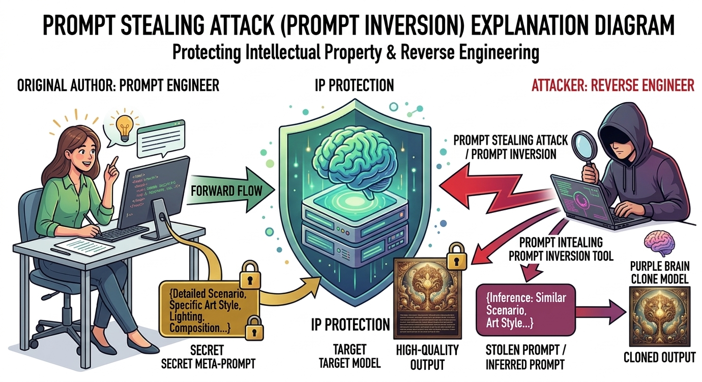

# Awesome Prompt Inversion 

🌍 *Languages: [English](README.md) | [中文](README_zh.md)*

  
   
  <em>Image generated by <strong>Gemini</strong></em>

This is a meticulously curated collection of research papers, tools, datasets, and resources strictly dedicated to **Prompt Inversion** (Prompt Extraction / Reverse Prompting) in Foundation Models, including Large Language Models (LLMs), Vision-Language Models (VLMs), and Diffusion Models.

**Prompt Inversion** refers to the process of reverseengineering a model to discover the exact or optimal discrete text prompts that generated a specific output, such as a target image, a specific text response, or a hidden model state.

This repository focuses on:

* **Image-to-Prompt (Diffusion/VLMs):** Extracting text prompts from generated or real images.
* **Output-to-Prompt (LLMs):** Reconstructing user inputs or system prompts based on generated text.
* **Security & Prompt Stealing:** Adversarial techniques to extract hidden system prompts, evaluate vulnerabilities, or expose memorized data in black-box models.

---

## 📋 Table of Contents

- [📝 Papers](#-papers)
  - [Prompt Inversion in Diffusion Models](#prompt-inversion-in-diffusion-models)
  - [LLM Prompt Extraction &amp; Reverse Prompting](#llm-prompt-extraction--reverse-prompting)
  - [Other Prompt-Related Papers](#other-prompt-related-papers)
- [🛠️ Tools &amp; Frameworks](#️-tools--frameworks)
- [🤝 Contributing](#-contributing)
- [📜 License](#-license)

---

## 📝 Papers

### Prompt Inversion in Diffusion Models

#### 2026
- **Towards Effective Prompt Stealing Attack against Text-to-Image Diffusion Models**, *Zhao et al., NDSS 2026.* [[Paper](https://arxiv.org/abs/2508.06837)] [[Code](https://github.com/Shiqian-Zhao996/Prometheus)]
- **Reinforcement Learning-Based Prompt Template Stealing for Text-to-Image Models**, *Zou et al., AAAI 2026.* [[Paper](https://arxiv.org/abs/2510.00046)] [None_Code]
- **PROMPTMINER: Black-Box Prompt Stealing against Text-to-Image Generative Models via Reinforcement Learning and Fuzz Optimization**, *Li et al., CVPR 2026.* [[Paper](https://arxiv.org/abs/2511.22119)] [[Code](https://github.com/aaFrostnova/PromptMiner)]
- **Invert Your Prompt: Editing-Aware Diffusion Inversion**, *Xu et al., IJCV 2025.* [[Paper](https://dl.acm.org/doi/10.1007/s11263-025-02691-1)] [None_Code]
- **PromptTrace: A Fine-Grained Prompt Stealing Attack via CLIP-Guided Beam Search for Text-to-Image Models**, *Ming et al., Symmetry 2026.* [[Paper](https://www.mdpi.com/2073-8994/18/1/161)] [None_Code]

#### 2025
- **Prompt Inference Attack on Distributed Large Language Model Inference Frameworks**, *Luo et al., CCS 2025.* [[Paper](https://arxiv.org/abs/2503.09291)] [[Code](https://github.com/xinjianluo/LLM-Prompt-Inference)]
- **Prompt Pirates Need a Map: Stealing Seeds helps Stealing Prompts**, *Mächtle et al., arXiv 2025.* [[Paper](https://arxiv.org/abs/2509.09488)] [[Code](https://github.com/UzL-ITS/Prompt-Pirate)]
- **Hidden No More: Attacking and Defending Private Third-Party LLM Inference**, *Thomas et al., ICML 2025.* [[Paper](https://openreview.net/forum?id=mLzUAoYBbs)] [[Code](https://github.com/ritual-net/vma-external)]

#### 2024
- **PRSA: Prompt Stealing Attacks against Real-World Prompt Services**, *Yang et al., USENIX Security 2025.* [[Paper](https://www.usenix.org/conference/usenixsecurity25/presentation/yang-yong)] [[Code](https://github.com/yangyZJU/PRSA)]
- **Prompt Recovery for Image Generation Models: A Comparative Study of Discrete Optimizers**, *Williams et al., arXiv 2024.* [[Paper](https://arxiv.org/abs/2408.06502)] [None_Code]
- **Prompt Stealing Attacks Against Text-to-Image Generation Models**, *Shen et al., USENIX Security 2024.* [[Paper](https://arxiv.org/abs/2302.09923)] [[Code](https://github.com/verazuo/prompt-stealing-attack)]
- **On the Effectiveness of Prompt Stealing Attacks on In-the-Wild Prompts**, *Tan et al., IEEE Access 2024.* [[Paper](https://ieeexplore.ieee.org/document/11023383)] [None_Code]
- **Prompting Hard or Hardly Prompting: Prompt Inversion for Text-to-Image Diffusion Models**, *Mahajan et al., CVPR 2024.* [[Paper](https://openaccess.thecvf.com/content/CVPR2024/papers/Mahajan_Prompting_Hard_or_Hardly_Prompting_Prompt_Inversion_for_Text-to-Image_Diffusion_CVPR_2024_paper.pdf)] [[Code](https://github.com/ubc-vision/Prompting-Hard-Hardly-Prompting)]
- **Source Prompt Disentangled Inversion for Boosting Image Editability with Diffusion Models**, *Li et al., ECCV 2024.* [[Paper](https://arxiv.org/abs/2403.11105)] [[Code](https://github.com/leeruibin/SPDInv)]

#### 2023
- **Hard Prompts Made Easy: Gradient-Based Discrete Optimization for Prompt Tuning and Discovery**, *Wen et al., NeurIPS 2023.* [[Paper](https://arxiv.org/abs/2302.03668)] [[Code](https://github.com/YuxinWenRick/hard-prompts-made-easy)]
- **Negative-Prompt Inversion: Fast Image Inversion for Editing with Text-Guided Diffusion Models**, *Miyake et al., WACV 2025.* [[Paper](https://openaccess.thecvf.com/content/WACV2025/html/Miyake_Negative-Prompt_Inversion_Fast_Image_Inversion_for_Editing_with_Text-Guided_Diffusion_WACV_2025_paper.html)] [None_Code]
- **Prompt Tuning Inversion for Text-Driven Image Editing Using Diffusion Models**, *Dong et al., ICCV 2023.* [[Paper](https://openaccess.thecvf.com/content/ICCV2023/papers/Dong_Prompt_Tuning_Inversion_for_Text-driven_Image_Editing_Using_Diffusion_Models_ICCV_2023_paper.pdf)] [None_Code]
- **Reverse Stable Diffusion: What prompt was used to generate this image?**, *Croitoru et al., CVIU 2024.* [[Paper](https://arxiv.org/abs/2308.01472)] [[Code](https://github.com/CroitoruAlin/Reverse-Stable-Diffusion)]
- **Synthetic Population of Binary Cepheids. II. The effect of companion light on the extragalactic distance scale**, *Karczmarek et al., ApJ 2023.* [[Paper](https://doi.org/10.3847/1538-4357/acc845)] [None_Code]

---

### LLM Prompt Extraction & Reverse Prompting

#### 2024
- **Prompt Stealing Attacks Against Large Language Models**, *Sha et al., arXiv 2024.* [[Paper](https://arxiv.org/abs/2402.12959)] [None_Code]

#### 2023
- **Effective Prompt Extraction from Language Models**, *Zhang et al., COLM 2024.* [[Paper](https://arxiv.org/abs/2307.06865)] [[Code](https://github.com/y0mingzhang/prompt-extraction)]

---

### Other Prompt-Related Papers

*Image Captioning, Prompt Optimization, Prompt Generation, etc.*

#### 2025
- **Stealix: Model Stealing via Prompt Evolution**, *Zhuang et al., ICLR 2025.* [[Paper](https://openreview.net/forum?id=kvN8MJTOCM)] [[Code](https://zhixiongzh.github.io/stealix/)]
- **InvSeg: Test-Time Prompt Inversion for Semantic Segmentation**, *Lin et al., AAAI 2025.* [[Paper](https://arxiv.org/abs/2410.11473)] [[Code](https://jylin8100.github.io/InvSegProject)]
- **Segment Anyword: Mask Prompt Inversion for Open-Set Grounded Segmentation**, *Liu et al., ICML 2025.* [[Paper](https://arxiv.org/abs/2505.17994)] [[Code](https://zhihualiued.github.io/segment_anyword)]

#### 2024
- **IterInv: Iterative Inversion for Pixel-Level T2I Models**, *Tang et al., ICME 2024.* [[Paper](https://arxiv.org/abs/2310.19540)] [[Code](https://github.com/Tchuanm/IterInv)]

- **PnP Inversion: Boosting Diffusion-based Editing with 3 Lines of Code**, *Ju et al., ICLR 2024.* [[Paper](https://arxiv.org/abs/2310.01506)] [[Code](https://github.com/cure-lab/PnPInversion)]

#### 2023
- **PromptCap: Prompt-Guided Task-Aware Image Captioning**, *Hu et al., ICCV 2023.* [[Paper](https://arxiv.org/abs/2211.09699)] [[Code](https://github.com/Yushi-Hu/PromptCap)]
- **Visual Instruction Inversion Image Editing via Image Prompting**, *Nguyen et al., NeurIPS 2023.* [[Paper](https://arxiv.org/abs/2307.14331)] [[Code](https://thaoshibe.github.io/visii/)]

#### 2020
- **AUTOPROMPT: Eliciting Knowledge from Language Models with Automatically Generated Prompts**, *Shin et al., EMNLP 2020.* [[Paper](https://arxiv.org/abs/2010.15980)] [[Code](http://ucinlp.github.io/autoprompt)]

---

## 🛠️ Tools & Frameworks

- [CLIP Interrogator](https://github.com/pharmapsychotic/clip-interrogator) - A tool to reverse-engineer prompts from images by combining CLIP and BLIP.
- [Diffusion Model (Diffusers)](https://huggingface.co/docs/diffusers/index) - The go-to library for state-of-the-art diffusion models.

---

## 🤝 Contributing

Contributions are very welcome! If you know of any awesome papers, tools, or resources specifically addressing **Prompt Inversion** or **Prompt Extraction**, please feel free to open a pull request.

Please ensure your pull request adheres to the following guidelines:

- The paper/tool must strictly relate to extracting, reconstructing, or optimizing **discrete text prompts** from outputs/images.
- Please use the provided format: `**Title** - *Authors, Venue Year.* [[Paper](link)] [[Code](link)]`

---

## 📜 License

